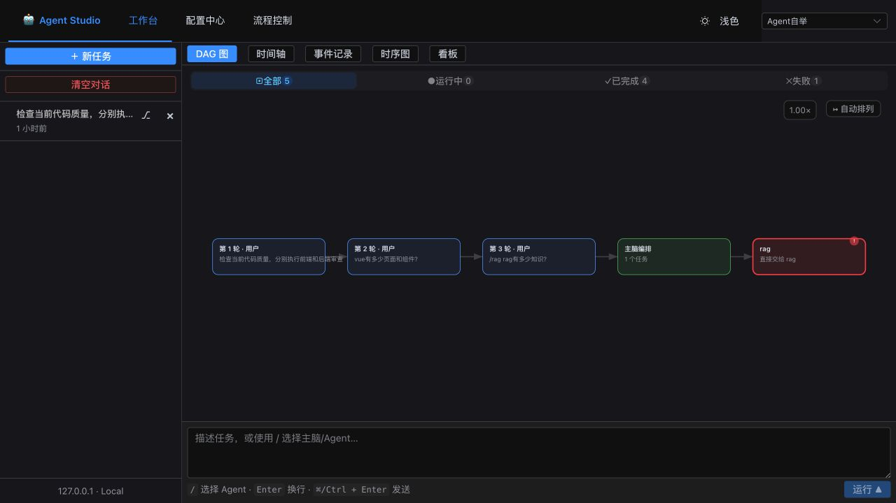
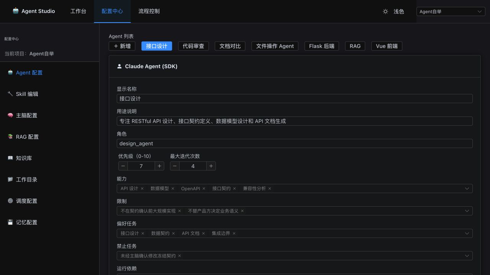
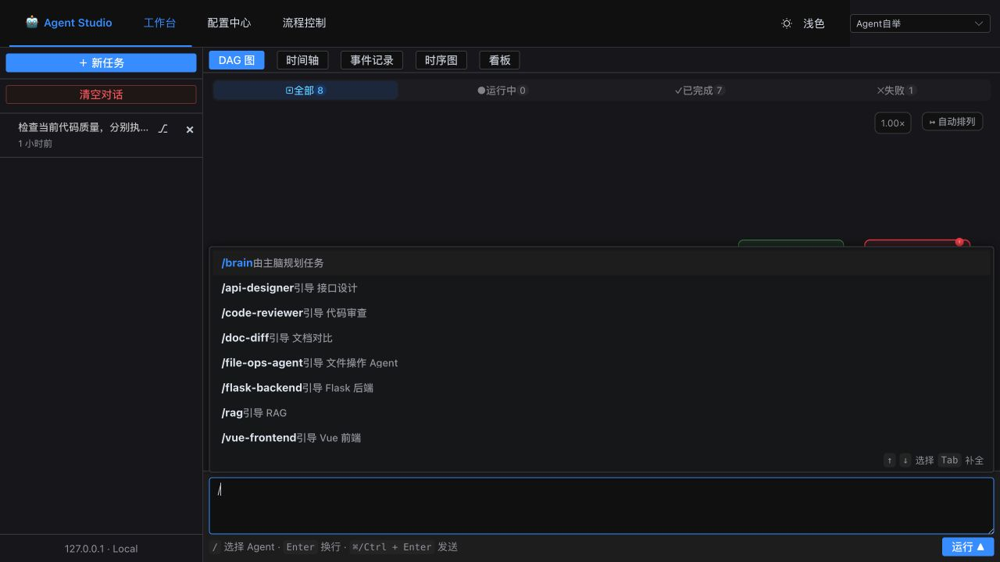
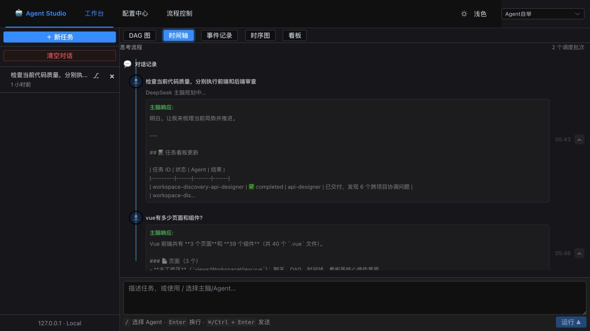
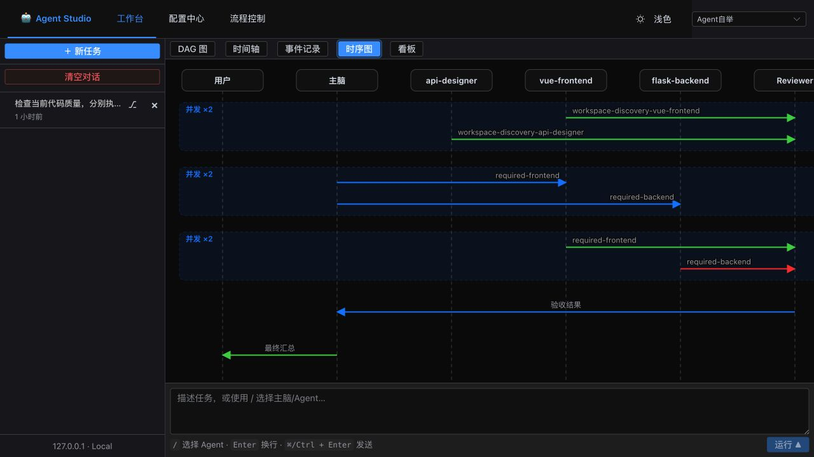
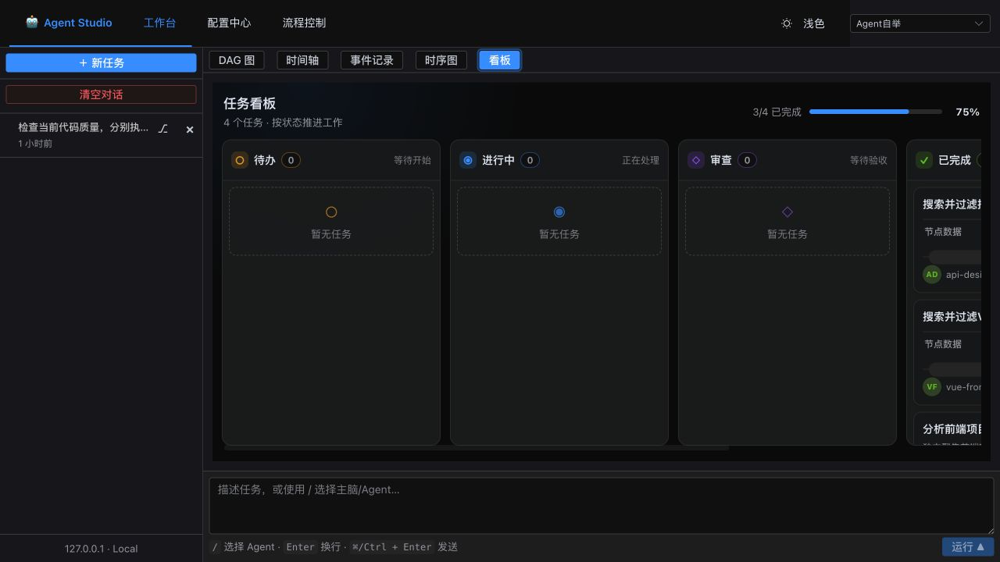
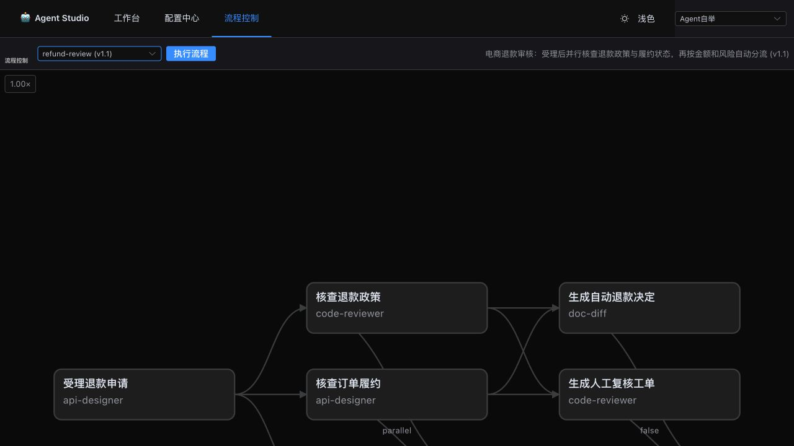

# Agent Studio

Agent Studio 是一个仅在本机运行的多 Agent 协作工作台。用户描述目标后，DeepSeek 主脑会先理解项目状态，再生成可验收的任务 DAG；LangGraph 负责依赖调度、并行执行、审查与返工；Claude、RAG、文件操作等专业 Agent 负责真实执行。

系统遵循一套明确的协作边界：

- 主脑拥有规划、委派、冲突处理和验收权，不代替专业 Agent 大量执行。
- 执行 Agent 按能力、限制、已关联 Skill、任务偏好、负载和依赖接受任务。
- 看板保存共享事实、决策、产物和阻塞。
- Reviewer 对照验收条件检查结果，失败时生成有限次数的修正任务。
- 所有服务固定绑定 `127.0.0.1`，项目数据保存在本机。

## 主要功能

### 分级规划与可验证执行

- 简单问答由主脑直接回复，不创建无意义 DAG。
- 单领域任务只选择一个合适 Agent。
- 复杂任务先探索项目，再冻结公共契约，之后按依赖串行或并行实施。
- 每个任务携带预期产物、验收条件、工具范围、禁止操作、优先级和最大迭代次数。
- Agent 结果统一报告产物、决策、假设、风险、依赖、验证和下一步。

### Agent 团队与配置

- 支持 Claude、RAG、文件操作、Chat、文档对比、Blackboard 和 Todo Agent。
- 项目可选择 `Manual`、`Edit Automatically`、`Plan` 或 `Auto` 工作模式，由主脑统一控制规划与执行。
- Agent 配置包含 `role`、`capabilities`、`limitations`、`preferred_tasks`、`forbidden_tasks`、`skills`、输入/输出契约、优先级和迭代上限。
- 配置中心可创建 Agent、关联项目 Skill、调整工作目录、调度、记忆和主脑提示词。
- Agent 模板与 Flow 模板可复用，项目实例数据彼此隔离。

### 看板、审查与中断

- LangGraph 自动把当前任务、上游结果、公共决策、产物、阻塞和可用工具注入 Agent 上下文。
- 每个 wave 汇流后进入 Reviewer；结果只能是 `accepted`、`accepted_with_risks`、`revision_required`、`rejected` 或 `blocked`。
- 支持暂停、继续、注入引导、重新规划和终止。
- 支持失败节点重试、运行分叉和连续对话，上游上下文限制在最近 24,000 字符。
- 时间轴使用连续垂直主轴；Agent 内部事件垂直串联，仅并发批次通过圆角正交折线分流并汇回主轴。

### 本地知识、记忆与运行状态

- SQLite FTS5 知识库，支持检索、导入、关系和反馈。
- LangMem 管理 Agent、Planner、Session 和 Project 分层记忆。
- LangGraph checkpoint、任务、事件、知识、记忆和看板均保存在当前项目目录。
- SSE 实时展示规划、Agent、工具、Skill、审查、记忆和最终汇总事件。

### 项目级数据隔离

所有新建项目的数据统一保存在：

```text
.workspace/<project_name>/
├── project.yaml
├── brain.yaml
├── workspace.yaml
├── scheduler.yaml
├── memory.yaml
├── agents/
├── skills/
├── flows/
└── db/
    ├── agents-manager.db
    └── checkpoints.db
```

当前启用项目由 `.workspace/current-project.yaml` 指定：

```yaml
project_id: agent-studio
```

`project_id` 同时是 `<project_name>` 目录名。切换项目时，配置、运行记录、RAG 数据、记忆、看板和 checkpoint 会一起切换，不会继续写入上一个项目。

## 快速开始

需要 Python 3.11+、Node.js 20+ 和 npm。

复制环境变量模板：

```bash
cp .env.example .env
```

至少配置 DeepSeek。Claude 可通过 CC Switch，也可直连 Anthropic：

```dotenv
DEEPSEEK_API_KEY=your-deepseek-key
DEEPSEEK_BASE_URL=https://api.deepseek.com
DEEPSEEK_MODEL=deepseek-v4-pro

# CC Switch 本地路由
ANTHROPIC_BASE_URL=http://127.0.0.1:15721
ANTHROPIC_AUTH_TOKEN=PROXY_MANAGED
ANTHROPIC_API_KEY=
CLAUDE_MODEL=claude-sonnet-4-5
```

一键启动：

```bash
./start.sh
```

启动后默认在终端持续输出后端日志，并同步保存到 `.run/backend.log`；设置
`LOG_LEVEL=DEBUG` 可查看逐条内部事件。日志轮换和关闭跟随方式见[自举与本地启动](docs/bootstrap.md)。

需要稳定运行 `main`、同时在本地继续开发时使用自举沙箱：

```bash
./bootstrap.sh
```

自举会从已提交的 `main` 创建 `.sandbox`，复制本地 `.env`，然后把本地工作区切换到
`dev`（不存在时自动创建）。详细规则见[自举与本地启动](docs/bootstrap.md)。

浏览器访问：

```text
http://127.0.0.1:5173
```

停止服务：

```bash
./stop.sh
```

首次启动会自动创建虚拟环境并安装依赖。未配置模型凭据时进入演示模式，只生成本地模拟事件，不修改用户项目。

## 使用流程

1. 在项目管理中创建项目，填写显示名称、稳定的项目标识和代码根目录。
2. 从模板添加 Agent，或按能力、限制、Skill 和任务边界手动配置。
3. 在配置中心维护项目 Skill、知识库、主脑、调度和记忆策略。
4. 输入目标；主脑会按复杂度直接回答、调用单 Agent 或生成多 Agent DAG。
5. 在 DAG、连续时间轴、并发时序图和看板中观察执行、审查及返工。
6. 运行中可用 `/brain` 或动态 Agent 命令引导，也可中止单个节点。

聊天框支持：

| 命令 | 作用 |
| --- | --- |
| `/brain <指令>` | 空闲时交给主脑规划；运行中引导主脑并按需重规划 |
| `/<agent-name> <指令>` | 空闲时创建单 Agent 任务；运行中只引导目标 Agent |

命令菜单从当前项目的 Agent 配置动态生成。Flow 由主脑根据目标自动选择，也可以在
Flow 管理页通过结构化接口手动执行。

## 项目结构

```text
AgentStudio/
├── frontend/                 Vue 3、TypeScript、Element Plus、DAG 与配置界面
├── backend/                  Flask API、LangGraph、Agent 执行器与 SQLite
│   ├── app/agents/           Agent 注册、选择、上下文和执行器
│   ├── app/orchestration/    调度、并发冲突、Reviewer 与返工
│   ├── app/planning/         主脑规划、结构化计划与校验
│   ├── app/prompts/          公共协议、角色提示词和组合器
│   ├── app/services/         项目、知识、记忆、看板和运行服务
│   └── tests/                后端单元与集成测试
├── templates/                Agent、Flow、主脑和项目数据模板
├── .workspace/               本机项目数据（不提交 Git）
├── docs/                     技术架构与界面素材
├── start.sh                  一键启动
└── stop.sh                   一键停止
```

## 开发与验证

后端：

```bash
cd backend
.venv/bin/pytest -q
```

前端：

```bash
cd frontend
npm run build
```

## 文档

- [技术架构](docs/technical-architecture.md)
- [自举与本地启动](docs/bootstrap.md)
- [Agent 与 Skill 模版](docs/agent-skill-templates.md)
- [Project Mode](docs/project-modes.md)
- [Flow 管理](docs/flow-management.md)
- [Flow YAML 参考](docs/flow-yaml-reference.md)
- [项目数据目录模板](templates/project/README.md)

## 界面截图

### 多 Agent 工作台



### 配置中心



### 斜杠命令



### 执行时间轴



### Agent 时序图



### 任务看板



### 流程控制


