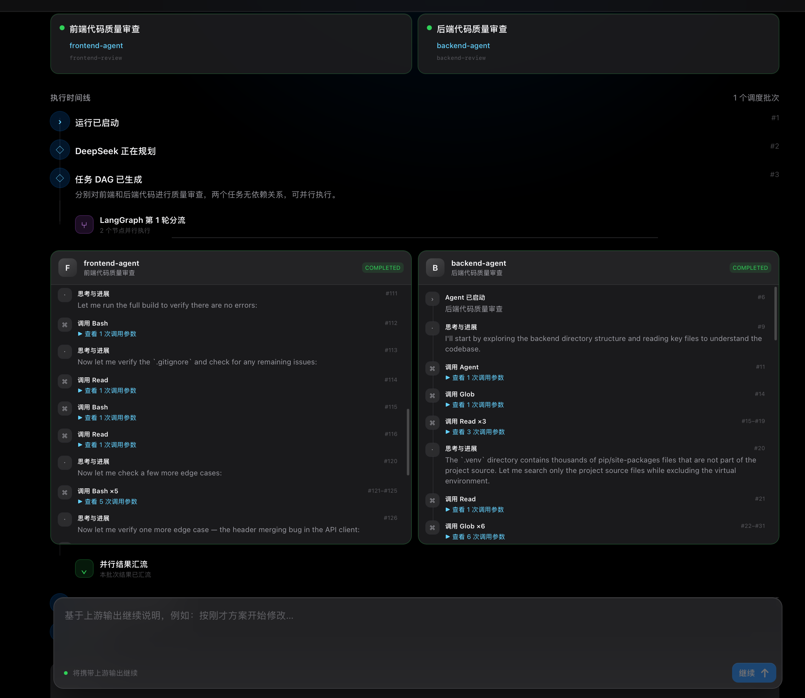
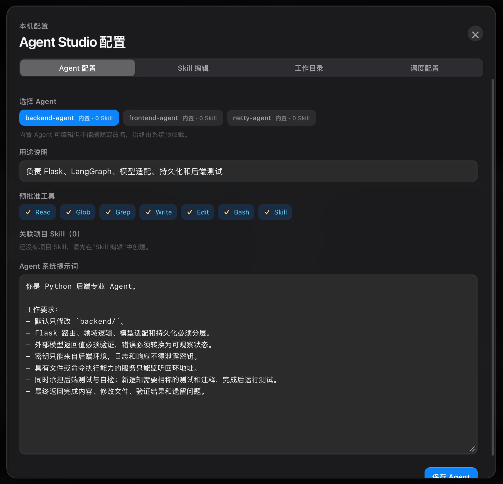
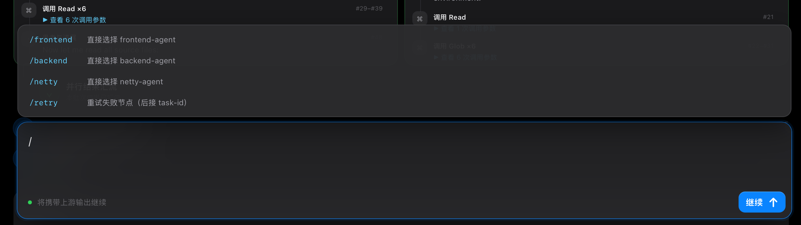
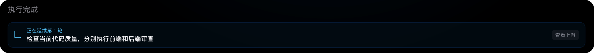

# Agent Studio

Agent Studio 是一个仅在本机运行的多项目软件工程 Agent 工作台。你先选择一个包含待改造项目的工作空间，再描述目标；Claude 专业 Agent 会搜索并过滤真实项目，DeepSeek 主脑根据发现结果选择项目、定义跨项目契约并生成实施 DAG，LangGraph 负责分流、并行执行和汇流。

项目内置三个可配置的执行 Agent：

- `frontend-agent`：发现并处理工作空间中的 Web 前端项目，不限定固定目录或框架。
- `backend-agent`：发现并处理工作空间中的业务后端、API 和持久化项目。
- `netty-agent`：Netty 数据接收、协议解析、编码发送和传输测试。

> 项目强制绑定 `127.0.0.1`，配置、任务记录、Token 统计和工作目录信息都保存在本机。

## 主要功能

### 项目发现、契约规划和并行执行

- 相关专业 Agent 先在所选工作空间中递归搜索构建清单、源码入口和已有接口，过滤候选项目；不会假定项目叫 `frontend/`、`backend/` 或 `netty/`。
- 发现结果汇流后，DeepSeek 选择实际项目并生成共享 HTTP API 或二进制协议契约。
- DeepSeek 再生成经过校验的实施 DAG，任务携带真实项目相对路径和精确 `write_scope`。
- LangGraph 按依赖关系把可并行节点同时分发给 Claude Agent；契约明确后，前后端可以同步编码而不必互相等待。
- 每一批 Agent 完成后经过显式 barrier 汇流，再执行下游节点。
- DeepSeek 在普通任务结束时读取全部执行结果并做最终验收。

### 可观察的 Agent 时间线

- 实时显示规划、分流、Agent 启动、工具调用、Skill 加载、汇流和最终输出。
- 多个 Agent 在独立泳道中并行展示。
- 页面直接展示 DeepSeek 生成的共享接口/协议契约。
- 每条 Agent 泳道可以独立折叠，折叠后保留任务标题和运行状态。
- 连续的同名工具调用自动合并，展开后仍能查看每次调用参数。
- 正在工作的 Agent 会在右侧状态栏持续闪烁，完成或失败后自动停止。
- 失败节点显示完整错误类型、摘要和执行器返回原因。

### 连续任务

选中一个已结束的历史任务后继续输入，聊天框会进入“继续”模式。新一轮会继承：

- 上游目标与最终输出。
- Claude Agent 的执行结果和失败摘要。
- 原任务使用的工作目录。
- 最近最多 8 轮、总计不超过 24,000 字符的本地上下文。

点击左侧“新建任务”后才会创建不携带历史上下文的新对话链。

### 指定 Agent 和失败重试

聊天框支持斜杠命令：

| 命令 | 作用 |
| --- | --- |
| `/frontend <指令>` | 直接交给 `frontend-agent` |
| `/backend <指令>` | 直接交给 `backend-agent` |
| `/netty <指令>` | 直接交给 `netty-agent` |
| `/agent <frontend\|backend\|netty> <指令>` | 使用统一格式选择 Agent |
| `/retry <task-id>` | 重试当前上游运行中的失败节点 |

直接选择 Agent 时会跳过 DeepSeek 规划和最终汇总，由 LangGraph 运行单个 Claude Agent，并把 Agent 结果直接作为本轮输出。失败的 DAG 节点也会在页面上显示“重试”按钮。

### 页面配置中心

无需手工编辑项目文件，即可在页面内管理：

- DeepSeek 主脑的规划决策提示词和最终验收提示词。
- Agent 的用途、系统提示词、工具权限和关联 Skill。
- Skill 的创建、内容修改和 Agent 分配。
- 默认工作目录的浏览、选择和持久化。
- LangGraph 最大并行数和图递归上限。
- Claude Agent 最大交互轮次和单节点超时时间。

默认主脑模板位于 `config/brain.default.json`。页面保存后的本机覆盖配置写入 `backend/instance/brain.json`；Agent 与 Skill 的配置分别写入 `agents/*.md` 和 `.claude/skills/*/SKILL.md`。

### DeepSeek 余额和本地用量

- 查询 DeepSeek 账户可用余额、充值余额和赠送余额。
- 本地记录本项目发起的 DeepSeek 输入、缓存命中、缓存未命中和输出 Token。
- 汇总今日、本月和本地累计用量。
- 根据 `.env` 中的单价估算美元花费，并明确标注“本地统计 · 费用估算”。

本地用量不会补录启用前或其他客户端产生的请求，估算金额也不等同于 DeepSeek 官方账单。

### 本地任务管理

- SQLite 持久化任务、事件、对话链和 DeepSeek 用量。
- 支持停止活动任务和删除终态任务记录。
- 自动清理后端重启后遗留的脏运行状态。
- 左右侧栏默认打开，可分别折叠，让中间工作区自动扩展。
- SSE 断线后按照事件序号恢复，减少重复时间线记录。

## 快速开始

需要 Python 3.11+、Node.js 20+ 和 npm。

项目默认提供 CC Switch 本地路由示例：

```bash
cp .env.example .env
```

至少配置 DeepSeek；Claude 可以使用 CC Switch，也可以改为直连 Anthropic：

```dotenv
DEEPSEEK_API_KEY=your-deepseek-key
DEEPSEEK_BASE_URL=https://api.deepseek.com
DEEPSEEK_MODEL=deepseek-chat

# CC Switch 本地路由
ANTHROPIC_BASE_URL=http://127.0.0.1:15721
ANTHROPIC_AUTH_TOKEN=PROXY_MANAGED
ANTHROPIC_API_KEY=
```

一键启动：

```bash
./start.sh
```

浏览器访问：

```text
http://127.0.0.1:5173
```

停止服务：

```bash
./stop.sh
```

未配置模型凭据时会进入演示模式，用模拟 Agent 事件验证 DAG、并行调度、SQLite 和前端时间线，不会修改所选工作区。

## 使用流程

1. 打开右上角“配置中心”，选择包含一个或多个待改造项目的本地工作空间。
2. 按需调整主脑提示词，以及 Agent 最大轮次、超时时间和并行数量。
3. 在聊天框描述目标，或输入 `/` 直接选择专业 Agent。
4. 在时间线中观察项目发现、DeepSeek 契约规划、LangGraph 分流和 Claude 工具调用。
5. 任务结束后直接继续输入，基于上游输出开始下一轮。
6. 某个节点失败时点击“重试”，或输入 `/retry <task-id>`。

## 项目结构

```text
AgentsManager/
├── frontend/          Vue 3 + TypeScript 管理界面
├── backend/           Flask API、LangGraph、模型适配和 SQLite
├── agents/            三个内置 Claude Agent 声明
├── .claude/skills/    项目级 Skill
├── config/            Claude / CC Switch 配置示例
├── docs/              技术架构和截图素材
├── start.sh           本地一键启动
└── stop.sh            停止本地服务
```

## 文档

- [完整技术架构、LangGraph 流程和 Agent/Skill 说明](docs/technical-architecture.md)

## 界面截图

### 并行 Agent 与执行时间线



### 页面配置中心



### 斜杠命令菜单



### 连续任务上下文


