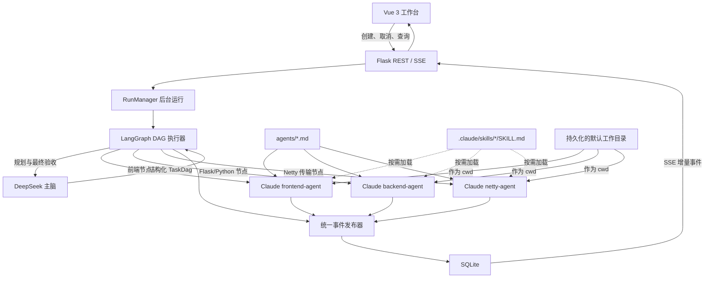
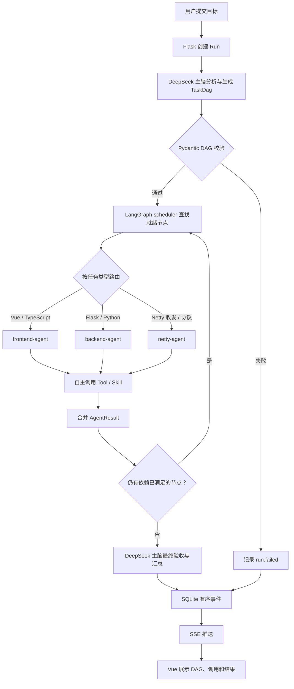

# Agent Studio 技术架构

> 面向使用者的功能介绍和快速上手请查看[项目 README](../README.md)。

Agent Studio 是一个仅限本机访问的软件工程 Agent 工作台。系统采用一个主脑、三个执行 Agent 的简化结构：

- **DeepSeek 主脑**：理解目标、做架构判断、生成任务 DAG、决定依赖关系，并在执行结束后验收和汇总结果。
- **Claude frontend-agent**：负责 Vue 前端实现、前端测试和构建检查。
- **Claude backend-agent**：负责 Flask/Python 后端、LangGraph 编排相关实现、后端测试和静态检查。
- **Claude netty-agent**：负责 Java Netty 数据接收、拆包解析、编码发送和传输层测试。

LangGraph 不参与模型层面的“思考”，只负责可靠执行 DeepSeek 生成的 DAG；Claude Agent 不负责全局调度，只在分配到的节点内自主读取代码、修改文件和运行工具。

规划前，后端会向 DeepSeek 提供当前工作目录最多两层的路径名称，帮助它识别真实的 frontend、backend 和 Netty 子项目，不读取文件内容或 `.env`。规划后还会执行确定性领域校验：用户明确提到“前后端”时，DAG 必须同时包含 frontend-agent 与 backend-agent；明确排除某个领域时，对应节点会被移除。这样模型提示词负责语义拆解，代码约束负责保证用户明确指定的 Agent 不会漏调。

## 一键启动

需要 Python 3.11+、Node.js 20+ 和 npm。

```bash
cp .env.example .env
./start.sh
```

首次启动会创建 `backend/.venv` 并安装前后端依赖。启动成功后访问：

```text
http://127.0.0.1:5173
```

在启动终端按 `Ctrl+C`，或执行下面的命令，同时停止前后端：

```bash
./stop.sh
```

未配置 API Key 时自动进入演示模式。演示模式仍会真实执行 LangGraph DAG、并行调度、SQLite 持久化和 SSE 事件流，但 Claude 节点只发送模拟事件，不会修改工作区。

## 连续任务与上游上下文

聊天框支持两种明确模式：

- 选中一个已完成、失败或取消的历史任务时再次发送，按钮显示“继续”，新运行通过 `parent_run_id` 延续当前任务。
- 点击左侧“新建任务”后再发送，不携带任何历史上下文，创建新的对话链。

每次运行仍是可独立停止、检查和删除的 LangGraph 执行实例，但 SQLite 会额外保存 `conversation_id` 与 `turn_index`。继续任务固定继承上游工作目录，并将最近最多 8 轮的用户目标、最终汇总、失败原因和 Claude Agent 结果摘要整理为不超过 24,000 字符的上游上下文，交给 DeepSeek 生成新的任务 DAG。这样“继续”“按刚才的建议修改”等指代会基于真实上游输出解析，而不是被当作全新的孤立目标。

正在运行的任务不能作为上游继续，页面会等待其进入终态。后续运行的时间线上方会显示上游任务入口，左侧历史记录用“续 · 轮次”标识对话链中的后续轮次。

### Agent 定向命令与失败节点重试

聊天框输入 `/` 会显示本地命令菜单：

| 命令 | 作用 |
| --- | --- |
| `/frontend <指令>` | 跳过 DeepSeek 规划，只启动 `frontend-agent` |
| `/backend <指令>` | 跳过 DeepSeek 规划，只启动 `backend-agent` |
| `/netty <指令>` | 跳过 DeepSeek 规划，只启动 `netty-agent` |
| `/agent <frontend\|backend\|netty> <指令>` | 使用统一格式选择单个 Agent |
| `/retry <task-id>` | 从当前选中的上游运行中恢复并重试一个失败节点 |

失败的 DAG 卡片也会直接显示“重试”按钮，无需手工复制 task ID。重试不会让 DeepSeek 重新拆解整个目标，而是从上游 `plan.created` 和 `agent.failed` 事件恢复原 Agent、原任务目标、写入范围与失败原因，创建同一对话链中的单节点后续运行。当前工作区中已完成的修改会保留，Agent 会被要求检查已有进度后继续。

单 Agent 命令仍由 LangGraph 负责生命周期、停止和时间线记录，但跳过 DeepSeek 的规划与最终汇总，Claude Agent 的结果会直接作为本轮输出。这里延续的是 Agent Studio 保存的文本上下文和工作区状态，不是恢复 Claude SDK 内部未公开的模型会话。

## 模型配置

编辑根目录 `.env`：

```dotenv
DEEPSEEK_API_KEY=...
DEEPSEEK_BASE_URL=https://api.deepseek.com
DEEPSEEK_MODEL=deepseek-chat

ANTHROPIC_API_KEY=...
CLAUDE_MODEL=claude-sonnet-4-5
```

密钥只由 Flask 后端读取。浏览器调用的 `/api/status` 只返回“是否已配置”，不会返回密钥内容。

右侧栏会显示 DeepSeek 账户的可用余额、充值余额和赠送余额，并支持手动刷新。余额由 Flask 后端调用 DeepSeek 官方 `/user/balance` 接口获取，结果在后端缓存 60 秒；浏览器不会收到 API Key。若 `DEEPSEEK_BASE_URL` 指向不支持该接口的兼容代理，余额卡片会保留并显示具体查询错误，不影响任务执行。

同一卡片还会显示明确标记的“本地统计”：后端从每次 DeepSeek 规划和最终汇总响应的 `usage` 字段读取真实 token 数，写入本机 SQLite，并汇总今日、本月及自功能启用以来的用量。DeepSeek 响应不直接返回本次扣费，因此页面金额是按本地 `.env` 单价计算的美元估算，不等同于官方账单，也不会补录启用前或其他客户端产生的用量。

```dotenv
DEEPSEEK_CACHE_HIT_PRICE_USD_PER_MILLION=0.0028
DEEPSEEK_CACHE_MISS_PRICE_USD_PER_MILLION=0.14
DEEPSEEK_OUTPUT_PRICE_USD_PER_MILLION=0.28
```

价格单位均为 USD / 百万 token。模型或官方价格变化后应同步修改这三个值，服务重启后生效。

### 使用 CC Switch 本地路由

仓库提供了可以直接复制的本地示例：

```bash
cp .env.example .env
```

关键配置是：

```dotenv
ANTHROPIC_BASE_URL=http://127.0.0.1:15721
ANTHROPIC_AUTH_TOKEN=PROXY_MANAGED
ANTHROPIC_API_KEY=
```

这表示 Claude Agent SDK 把 Anthropic 格式请求发送到 CC Switch 的本地路由，由 CC Switch 当前启用的 Claude Provider 负责鉴权、模型映射和上游转发。它不是传统的 `HTTP_PROXY`/`HTTPS_PROXY` 网络代理配置。

使用前需要在 CC Switch 中启用 Local Routing，并启用 Claude 应用路由。`PROXY_MANAGED` 是 CC Switch 路由模式使用的占位 token，不应替换成真实上游密钥；真实 Provider 凭据由 CC Switch 自己管理。

如果还希望让普通 Claude Code 会话使用相同路由，可以参考：

```text
config/claude-settings.cc-switch.example.json
```

将其中 `env` 内容合并到 `~/.claude/settings.json`，不要直接覆盖已有的其他 Claude Code 配置。Agent Studio 本身只需要根目录 `.env`，不要求修改用户级 Claude 配置。

应用启动后，`/api/status` 会把 `claude_route` 标记为 `cc-switch`。只要存在 `ANTHROPIC_AUTH_TOKEN`，后端就会把 Claude 视为已配置，不会因为 `ANTHROPIC_API_KEY` 为空而进入 Claude 演示节点。

## 页面配置中心

工作台右上角提供“配置中心”，无需手工打开文件即可维护 Agent、Skill 和默认工作目录。

### Agent 配置

页面支持编辑已有的三个 Agent：

- 用途说明 `description`。
- 预批准工具 `tools`。
- 关联的项目级 Skill `skills`。
- Agent 系统提示词正文。

这三个 Agent 都是内置预设，启动时从 `agents/` 自动加载。页面不提供删除和改名操作，配置中心会显示“内置”标记；它们只能被调整工具、Skill、说明和提示词。

保存后会原子写回 `agents/<agent-name>.md`，新的配置从下一次 Agent 节点执行开始生效。Agent 名称不能在页面中修改，因为它同时受 DeepSeek 路由规则和 Pydantic 允许类型约束。

### Skill 配置

页面支持：

- 新建 Skill。
- 查看已有 Skill。
- 修改 Skill 的用途说明和指令正文。
- 将已有 Skill 关联到一个或多个 Agent。

Skill 保存到 `.claude/skills/<skill-name>/SKILL.md`。名称只能包含小写字母、数字和短横线，后端会拒绝路径字符和重复名称。

### Skill 数量含义

右侧 Agent 状态卡区分两种数量：

- **配置数量**：Agent Markdown 的 `skills` 列表中关联了多少个 Skill。
- **本次已加载数量**：当前运行中该 Agent 通过 `Skill` 工具实际加载了多少个不同 Skill。

配置数量不代表已经加载。Claude Agent 只有在任务需要并调用 `Skill` 工具后，才会产生 `skill.loaded` 事件并计入本次加载数量。

### 工作目录

配置中心的“工作目录”标签页可以浏览后端所在机器的文件夹，也可以直接输入绝对路径。单击文件夹表示选择，双击表示进入；点击“设为工作目录”后，后端把选择持久化到：

```text
backend/instance/workspace.json
```

页面刷新或服务重启后仍会保留该设置。之后创建的每个任务都会读取当时的默认工作目录，并把它记录在该次运行的 `workspace_root` 字段中；即使以后修改默认目录，历史运行仍能显示其原始目录。

Claude Agent SDK 会以该目录作为 `cwd`，所以 Agent 的文件读取、编辑和命令执行都从这里开始。Agent 声明和 Skill 配置仍由 Agent Studio 自身项目根目录下的 `agents/` 与 `.claude/skills/` 管理，不会随着任务工作目录改变。执行时后端通过 SDK 的 `add_dirs` 加入 Agent Studio 根目录，并通过 `skills` 选项只启用当前 Agent 关联的 Skill。

### 调度配置

“调度配置”标签页用于修改真正参与 LangGraph 和 Claude Agent 执行的运行限制：

| 配置 | 作用 |
| --- | --- |
| 最大并行 Agent | LangGraph 同一 super-step 最多并行运行的 worker 数 |
| 图递归上限 | 一次图运行允许经过的最大步骤数，深层 DAG 需要更高值 |
| Agent 最大轮次 | 每个 Claude Agent 节点允许的自主交互轮次 |
| Agent 超时时间 | 单个 Agent 节点的最长执行秒数 |

配置持久化在 `backend/instance/scheduler.json`。每个新运行在启动时读取一次配置快照；修改不会影响正在执行的任务。依赖失败策略目前固定为“阻塞下游、独立节点继续”，并且每一批所有 worker 返回后才允许通过 barrier 汇流。

`Agent 最大轮次` 对应 Claude Agent SDK 的 `max_turns`。一次模型回复及后续工具调用会消耗交互轮次；需要读取大量文件、反复编辑和测试的任务可能超过默认 12 轮。页面提供 30 轮快捷值，复杂任务通常可设置为 30–60，但更高值也会增加最长运行时间和模型费用。轮次耗尽时节点会明确标记为失败，而不会把不完整结果误报为完成。

## 整体架构



## LangGraph 使用情况

项目当前**确实使用了 LangGraph**，不是只把它写在技术栈或 README 中。

主要实现位于：

```text
backend/app/orchestration/graph.py
```

后台任务在 `RunManager` 中调用编译后的 LangGraph：

```text
RunManager._execute
└── build_graph(...)
    └── graph.invoke(...)
```

图包含五类节点：

| 节点 | 作用 |
| --- | --- |
| `plan` | 调用 DeepSeek 主脑生成并校验 `TaskDag` |
| `scheduler` | 根据已完成结果判断下一批就绪任务 |
| `worker` | 调用 frontend、backend 或 netty Claude Agent |
| `barrier` | 等待当前 super-step 的全部 worker 返回并汇流结果 |
| `synthesize` | 调用 DeepSeek 主脑验收并汇总全部结果 |

动态 DAG 不是通过模型生成 Python 源码实现的。控制图保持固定，`scheduler` 先冻结本批就绪任务，再使用 LangGraph `Send` 一次性分发给多个 `worker`。互不依赖的任务处于同一个 super-step 并行执行，`AgentResult` 列表通过 reducer 合并；只有所有 worker 都返回后才进入一次 `barrier`，随后再次回到 `scheduler`。因此下一批依赖任务和最终 DeepSeek 汇总都不会提前启动。

这种用法提供了：

- 动态任务数量与动态依赖。
- 前端、Flask 后端和 Netty 节点的并行执行。
- 每轮结果汇合后再继续调度。
- `max_concurrency` 并发限制。
- 明确的 plan → schedule → work → synthesize 生命周期。

当前 SQLite 保存的是应用运行和前端事件；尚未接入 LangGraph 持久化 checkpointer。需要节点级断点恢复时，可以在现有 `compile()` 位置增加 SQLite 或 PostgreSQL checkpointer。

### 一次任务的完整生命周期

1. Vue 调用 `POST /api/runs` 提交用户目标。
2. Flask 创建运行记录，`RunManager` 在后台线程启动 LangGraph。
3. LangGraph 的 `plan` 节点调用 DeepSeek 主脑。
4. DeepSeek 返回经过 Pydantic 校验的 `TaskDag`，任务只能交给 `frontend-agent`、`backend-agent` 或 `netty-agent`。
5. `scheduler` 找出依赖已经满足的节点，并通过 LangGraph `Send` 并行分发。
6. `worker` 读取对应的 Agent Markdown，通过 Claude Agent SDK 启动专业 Agent。
7. Claude Agent 在自己的职责范围内自主调用 Read、Edit、Bash 等工具，并把消息、工具和 Skill 事件写入 SQLite。
8. 并行节点完成后，LangGraph reducer 合并结果并继续检查下一批依赖。
9. 所有可执行节点结束后，DeepSeek 主脑再次读取计划和执行结果，进行最终验收与汇总。
10. Vue 通过 SSE 按序接收事件，展示 DAG、Agent 状态、工具调用和最终结果。

### 为什么只保留三个 Claude Agent

架构、测试、审查不再拆成额外 Agent：

- 架构判断和任务依赖由 DeepSeek 主脑负责。
- 前端测试和构建检查由 `frontend-agent` 自己完成。
- Flask/Python 后端测试和静态检查由 `backend-agent` 自己完成。
- Netty 协议、收发链路和传输层测试由 `netty-agent` 自己完成。
- 跨任务验收和结果审查由 DeepSeek 主脑在汇总阶段完成。

这样可以减少上下文传递、重复调用和角色边界冲突，同时隔离普通业务后端与 Netty 数据传输这两个差异明显的技术领域。

## 整体执行流程图



## 后端分层

```text
backend/app/
├── api/
│   └── routes.py             REST、取消接口、历史查询和 SSE
├── agents/
│   ├── registry.py           加载并校验 agents/*.md
│   └── claude_executor.py    单个 Claude 专业节点的执行与事件适配
├── domain/
│   └── models.py             TaskDag、DagTask、AgentResult、RunEvent
├── events/
│   └── publisher.py          所有运行事件的统一入口
├── orchestration/
│   └── graph.py              LangGraph plan/scheduler/worker/synthesize
├── planning/
│   └── deepseek_planner.py   DeepSeek 规划和最终验收
├── services/
│   ├── container.py          显式依赖组装
│   └── run_manager.py        后台线程、取消信号和运行生命周期
└── storage/
    └── sqlite_store.py       运行历史与有序事件持久化
```

各层职责保持单一：HTTP 路由不直接调用模型，Claude 执行器不决定任务依赖，LangGraph 不读取环境密钥，SQLite 存储层不理解模型消息。

## 前端分层

```text
frontend/src/
├── api/client.ts             Flask API 和 SSE 地址
├── composables/
│   └── useWorkspace.ts       当前运行、历史、事件流和重连状态
├── components/
│   ├── AppHeader.vue         模型连接与本机状态
│   ├── RunSidebar.vue        历史运行
│   ├── PlanBoard.vue         DAG 节点状态
│   ├── EventTimeline.vue     Agent、工具、Skill 事件
│   ├── AgentInspector.vue    三个 Claude Agent 的当前状态
│   └── PromptComposer.vue    用户目标输入
└── App.vue                   工作台布局与组件组合
```

前端只消费统一的 `RunEvent`，不直接依赖 DeepSeek、LangGraph 或 Claude SDK 的原始事件格式。

## Agent Markdown 的作用

Agent 定义放在根目录 `agents/`，目前有三个文件：

```text
agents/
├── frontend-agent.md
├── backend-agent.md
└── netty-agent.md
```

每个文件由 YAML frontmatter 和正文提示词组成：

```markdown
---
name: frontend-agent
description: 该 Agent 的用途说明
tools:
  - Read
  - Edit
  - Bash
  - Skill
skills:
  - frontend-engineering
---

这里是 Claude Agent 的系统提示和工作边界。
```

字段作用：

- `name`：必须和 DeepSeek DAG 中的 `agent` 字段一致，也是前端显示的 Agent ID。
- `description`：帮助界面和维护者理解角色，不参与全局调度决策。
- `tools`：传给 Claude Agent SDK 的工具预批准列表。
- `skills`：该 Agent 在页面中关联的项目 Skill 名称，也是状态卡的“配置数量”来源。
- Markdown 正文：作为该 Claude Agent 的系统提示，规定职责、目录边界、验证要求和结果格式。

`AgentRegistry` 在后端启动时加载这些文件。缺少 frontmatter、缺少 `name` 或引用未知 Agent 时，系统会直接报错，不会静默使用错误角色。

### frontend-agent.md

[`agents/frontend-agent.md`](../agents/frontend-agent.md) 负责：

- Vue 3、TypeScript、Vite 和前端组件实现。
- 前端 API 类型、SSE 状态和交互体验。
- 加载态、空状态、错误态、取消与断线恢复。
- 可访问性、窄屏布局和键盘操作。
- 前端测试、TypeScript 检查和生产构建。
- 默认只修改 `frontend/`，不能擅自修改后端协议。

它适合接收“实现页面”“修改交互”“消费某个 API”“修复前端构建”等节点。

### backend-agent.md

[`agents/backend-agent.md`](../agents/backend-agent.md) 负责：

- Flask API、领域模型、持久化和服务层实现。
- LangGraph 节点、调度状态和模型适配器实现。
- DeepSeek、Claude Agent SDK 以及统一事件协议的后端接入。
- 密钥隔离、回环地址限制和错误处理。
- 后端测试、Ruff 静态检查和运行验证。
- 默认只修改 `backend/`，不能擅自改变前端行为。

它适合接收“增加 API”“调整 DAG”“修改数据库”“接入工具”“修复后端测试”等节点。

### netty-agent.md

[`agents/netty-agent.md`](../agents/netty-agent.md) 负责：

- Java Netty 的 `Channel`、`Pipeline`、`Handler` 和连接生命周期。
- TCP 粘包、拆包、半包、长度字段、分隔符与自定义二进制协议。
- 数据接收、字节流解码、业务消息解析、响应编码和异步发送。
- `ByteBuf` 引用计数、释放、切片和跨线程安全。
- EventLoop 非阻塞约束、背压、写缓冲区水位、心跳、重连和优雅关闭。
- 畸形报文、超长帧、超时、断连和未知消息类型的错误处理。
- 使用 `EmbeddedChannel` 进行解码器、编码器和 Handler 边界测试。
- Maven/Gradle 测试和静态检查。
- 默认只修改 `netty/` 或任务明确指定的 Java Netty 模块。

它适合接收“实现 TCP 数据接入”“解析设备协议”“处理粘包拆包”“编码并发送响应”“增加心跳重连”等节点。普通 Flask/Python 业务接口仍应交给 `backend-agent`。

## Agent 与 Skill 的声明位置

本项目区分“Agent 角色定义”和“Claude 可按需加载的 Skill”，两者不是同一种文件。

### Agent 声明位置

本应用实际使用的 Agent 声明位于：

```text
agents/frontend-agent.md
agents/backend-agent.md
agents/netty-agent.md
```

加载入口是 `backend/app/agents/registry.py`。DeepSeek DAG 中的 `agent` 字段必须和 Markdown frontmatter 的 `name` 完全一致。

这些文件不是 Claude Code 原生的 `.claude/agents/` 子 Agent 声明。本项目选择由 LangGraph 显式启动每个 Agent，因此使用自己的 `agents/` 目录和 `AgentRegistry`，便于取消、持久化和前端展示。

### Skill 声明位置

Claude Agent SDK 的执行目录来自配置中心保存的工作目录，并启用了 `setting_sources=["project"]`。后端还会把 Agent Studio 根目录作为 `add_dirs` 传入，因此自身维护的 Skill 与目标项目的 `cwd` 可以分离。Skill 声明在：

```text
.claude/skills/<skill-name>/SKILL.md
```

建议按三个执行领域组织：

```text
.claude/skills/
├── frontend-engineering/
│   └── SKILL.md              # Vue、TypeScript、UI 与前端测试规范
├── flask-backend/
│   └── SKILL.md              # Flask、LangGraph、SQLite 与 API 规范
└── netty-transport/
    └── SKILL.md              # Netty 协议、ByteBuf、收发链路与测试规范
```

这些 Skill 目录会由页面配置中心自动创建。添加实际 `SKILL.md` 后，对应 Claude Agent 可以通过 `Skill` 工具按需加载；三个 Agent Markdown 的 `tools` 已包含 `Skill`。

Agent 与 Skill 的关系建议保持为：

| Agent 声明 | 主要加载的 Skill | 作用 |
| --- | --- | --- |
| `agents/frontend-agent.md` | `.claude/skills/frontend-engineering/SKILL.md` | 前端工程规范和可复用流程 |
| `agents/backend-agent.md` | `.claude/skills/flask-backend/SKILL.md` | Flask/Python 后端工程规范 |
| `agents/netty-agent.md` | `.claude/skills/netty-transport/SKILL.md` | Netty 收发、协议解析和传输测试规范 |

Agent Markdown 定义长期角色和权限边界；Skill 存放按任务加载的专项知识、步骤、脚本或参考资料。不要把全局调度逻辑写进 Skill。

### Agent Markdown 不负责什么

Agent Markdown 只定义“这个执行者如何工作”，不定义：

- 当前用户任务需要调用哪个 Agent。
- Agent 之间的先后和并行关系。
- 失败后是否继续执行其他节点。
- 最终结果是否满足用户目标。

这些都由 DeepSeek 主脑生成的 DAG 和 LangGraph 执行状态决定。

## DAG 数据结构

DeepSeek 主脑输出类似：

```json
{
  "summary": "实现一个前后端任务管理功能",
  "tasks": [
    {
      "id": "backend-api",
      "title": "实现任务 API 并运行后端测试",
      "objective": "实现创建和查询任务的 Flask API",
      "agent": "backend-agent",
      "depends_on": [],
      "write_scope": ["backend/"]
    },
    {
      "id": "frontend-ui",
      "title": "实现任务页面并完成构建检查",
      "objective": "实现任务列表和创建交互",
      "agent": "frontend-agent",
      "depends_on": ["backend-api"],
      "write_scope": ["frontend/"]
    }
  ]
}
```

Pydantic 会拒绝重复 ID、未知依赖、自依赖、循环依赖和未知 Agent。LangGraph 的控制图是固定的，变化的是 `TaskDag` 数据，不会根据模型输出动态执行任意 Python 代码。

## 统一事件

后端会生成以下主要事件：

- `run.started`、`run.completed`、`run.failed`、`run.cancelled`
- `planner.started`、`planner.bypassed`、`plan.created`
- `wave.started`、`wave.completed`
- `agent.started`、`agent.message`、`agent.completed`、`agent.failed`
- `tool.started`、`skill.loaded`、`agent.usage`
- `brain.synthesizing`、`run.summary`

事件在 SQLite 中按每个运行的 `sequence` 单调递增。SSE 断线后，前端可以带上最后一个序号继续接收，避免重复显示。

### 并行执行视图

前端会根据 `TaskDag.depends_on` 计算与 LangGraph super-step 对应的调度批次。时间线在每个批次开始处显示分流节点，将可并行执行的任务放入独立 Agent 泳道；消息、工具调用、Skill 加载和完成状态只显示在所属任务的泳道中。全部节点结束后显示汇流，再进入下一批依赖任务，最后回到 DeepSeek 主脑验收。

同一泳道中连续出现的同名工具调用会折叠成一条记录，例如“调用 Read ×3”。展开后仍会按事件序号分别展示每一次调用参数；只要中间出现其他事件或工具名称变化，就会开始新的记录，不会跨操作合并。

这里展示的是 SSE 收到的真实 Agent 事件和模型主动返回的进展消息，不会虚构或暴露模型隐藏的内部推理链。

DeepSeek 规划尚未返回时，时间线会持续显示已等待秒数，并在响应较慢时说明可能是模型服务或代理排队，而不是让静止的“正在规划”看起来像页面卡死。Agent 节点失败时，所属泳道会同时展示失败分类、任务摘要和执行器返回的完整错误原因；轮次耗尽、超时、权限与鉴权错误会使用对应分类。

## 配置 API

页面配置中心使用以下仅限本机的 API：

| 方法 | 地址 | 作用 |
| --- | --- | --- |
| `GET` | `/api/agents` | Agent 摘要、关联 Skill 及数量 |
| `GET` | `/api/agents/<name>` | 完整 Agent 配置和提示词 |
| `PUT` | `/api/agents/<name>` | 修改已有 Agent |
| `GET` | `/api/skills` | Skill 列表 |
| `GET` | `/api/skills/<name>` | 完整 Skill 内容 |
| `POST` | `/api/skills` | 创建 Skill |
| `PUT` | `/api/skills/<name>` | 修改 Skill |
| `GET` | `/api/workspace` | 读取持久化的默认工作目录 |
| `PUT` | `/api/workspace` | 校验并保存默认工作目录 |
| `GET` | `/api/workspace/directories` | 浏览指定目录下的子文件夹 |
| `GET` | `/api/scheduler` | 读取持久化的 LangGraph 调度配置 |
| `PUT` | `/api/scheduler` | 校验并保存调度配置 |
| `GET` | `/api/deepseek/balance` | 读取 DeepSeek 余额；加 `?refresh=1` 可跳过缓存 |
| `GET` | `/api/deepseek/usage` | 读取本机 SQLite 累计的 token 与费用估算 |
| `DELETE` | `/api/runs/<run_id>` | 删除已结束的运行及其全部事件 |

后端启动时会把上一次进程遗留的 `queued/running` 记录恢复为 `failed`，因为对应 daemon worker 已随旧进程消失。若数据库中仍出现没有当前执行线程的活动记录，“停止”会直接将其转为 `cancelled`；删除接口也会识别这种孤儿记录，不会让测试脏数据永久卡在侧栏。

## 项目结构

```text
.
├── backend/                  Flask、LangGraph、模型接入和 SQLite
│   └── instance/             SQLite 与工作目录配置（运行时生成、已忽略）
├── frontend/                 Vue 3 工作台
├── agents/                   三个 Claude Agent Markdown
├── .claude/skills/           可选的项目级 Claude Skills
├── scripts/                  本地启动和停止实现
├── .env.example              DeepSeek 与 CC Switch 配置示例
├── config/                   Claude Code 配置片段示例
├── start.sh                  一键启动入口
└── stop.sh                   一键停止入口
```

## 本地安全边界

- Flask 和 Vite 都固定监听 `127.0.0.1`。
- 后端拒绝非回环 `BACKEND_HOST`。
- 启动脚本同时拒绝非回环前后端地址。
- CORS 只允许本机前端端口。
- 浏览器默认通过 Vite 的同源 `/api` 代理访问 Flask，避免本机跨端口请求在 Safari/WebKit 中被简化为 `Load failed`；代理目标仍固定为 `127.0.0.1:5000`。
- SQLite、日志、环境变量、依赖目录和虚拟环境均已忽略。
- 当前版本没有用户认证，不要通过反向代理暴露到公网。
- 前端只显示模型明确返回的消息和系统事件，不推断或伪造隐藏思考过程。
- 界面字号使用响应式 `rem + clamp()`：普通窗口保持紧凑，2K/4K 宽屏会平滑放大，主内容区和侧栏宽度也同步适配。

## 开发检查

```bash
backend/.venv/bin/pytest backend/tests -q
backend/.venv/bin/ruff check backend
npm --prefix frontend run build
```

运行日志保存在 `.run/backend.log` 和 `.run/frontend.log`。

## 当前边界

- 取消采用协作式取消：调度轮次间立即生效，Claude SDK 事件循环收到取消信号后结束消费。
- SQLite 加后台线程适合本地单用户；多用户部署时可把 `RunManager` 和 `EventPublisher` 替换为任务队列与 Redis Stream。
- `write_scope` 当前同时用于计划表达和 Agent 提示约束，还不是操作系统级沙箱。
